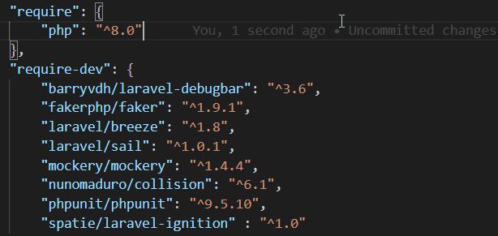

# VSCode Composer Helper

This [Visual Studio Code](https://code.visualstudio.com/) plugin offers intellisense for the PHP dependency manager [Composer](https://getcomposer.org/).

## Features

- Autocomplete dependency names based on [Packagist](https://packagist.org/)
- Display currently installed package version next to package entry (on document save)
- Hover over package names to get insights about the package
- Hover over package names to get the currently installed and latest available package version

## Planned Features

- Command to install / update dependencies inline

## Requirements

You should have [Composer](https://getcomposer.org/) installed. But the plugin is actually not relying on it.

## Credit

Fork from https://github.com/kainiklas/vscode-composer-intellisense
